# 🚀 AI Data Analyst

<div align="center">

### An End-to-End AI-Powered Data Analysis Platform

Upload a CSV dataset and perform an entire data science workflow — from data cleaning and exploratory data analysis to machine learning, AI-generated insights, and automated PDF reports — all without writing a single line of code.


</div>

---

## 🌟 Overview

AI Data Analyst is a **full-stack web application** that enables users to perform professional-grade data analysis directly from the browser.

Instead of writing Python scripts or Jupyter notebooks, users simply upload a CSV dataset and the application automatically guides them through an end-to-end data science workflow.

The platform combines modern web technologies with machine learning and local AI to provide an intuitive experience for students, analysts, and developers.

---

# ✨ Repository Highlights

- 📂 Upload CSV datasets up to **50 MB**
- 📊 Automatic dataset profiling
- 🧹 Powerful data cleaning utilities
- 📈 Interactive visualizations
- 🤖 Machine Learning model training
- 🧠 AI-powered insights using **Llama 3.2**
- 📄 Automatic PDF report generation
- 🔒 Runs completely locally (your data never leaves your computer)

---

## 📑 Table of Contents

- [Overview](#-overview)
- [Repository Highlights](#-repository-highlights)
- [Application Walkthrough](#-application-walkthrough)
- [Sample Dataset](#-sample-dataset)
- [Sample Generated Report](#-sample-generated-report)
- [Project Workflow](#-project-workflow)
- [Features](#features)
- [Tech Stack](#tech-stack)
- [Setup](#setup)
- [Running the Application](#running-the-application)
- [Project Structure](#project-structure)
- [API Endpoints](#api-endpoints)
- [FAQ](#faq)
- [Project Highlights](#-project-highlights)
- [Author](#-author)
- [License](#-license)

---

# 📸 Application Walkthrough

## 🏠 Home Page

Landing page where users can upload a CSV dataset and begin the analysis.

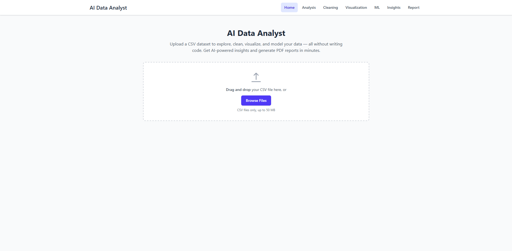

---

## 📊 Analysis Dashboard

Displays dataset overview including rows, columns, missing values, data types, and summary statistics.

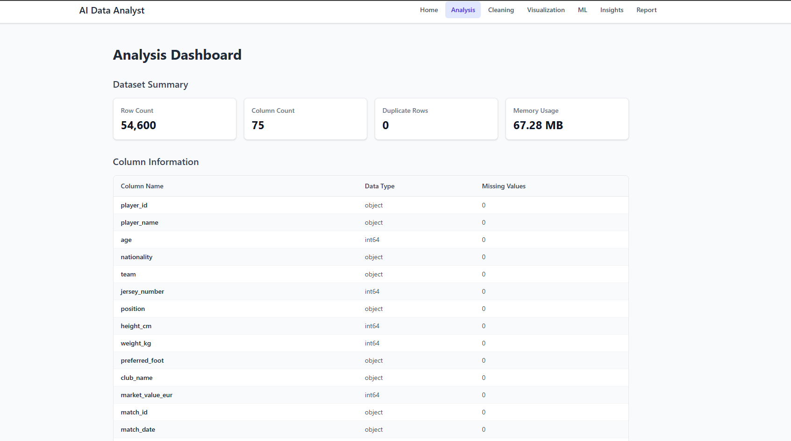

---

## 🧹 Data Cleaning (Step 1)

Clean missing values, remove duplicates, rename columns, convert data types and preprocess the dataset.

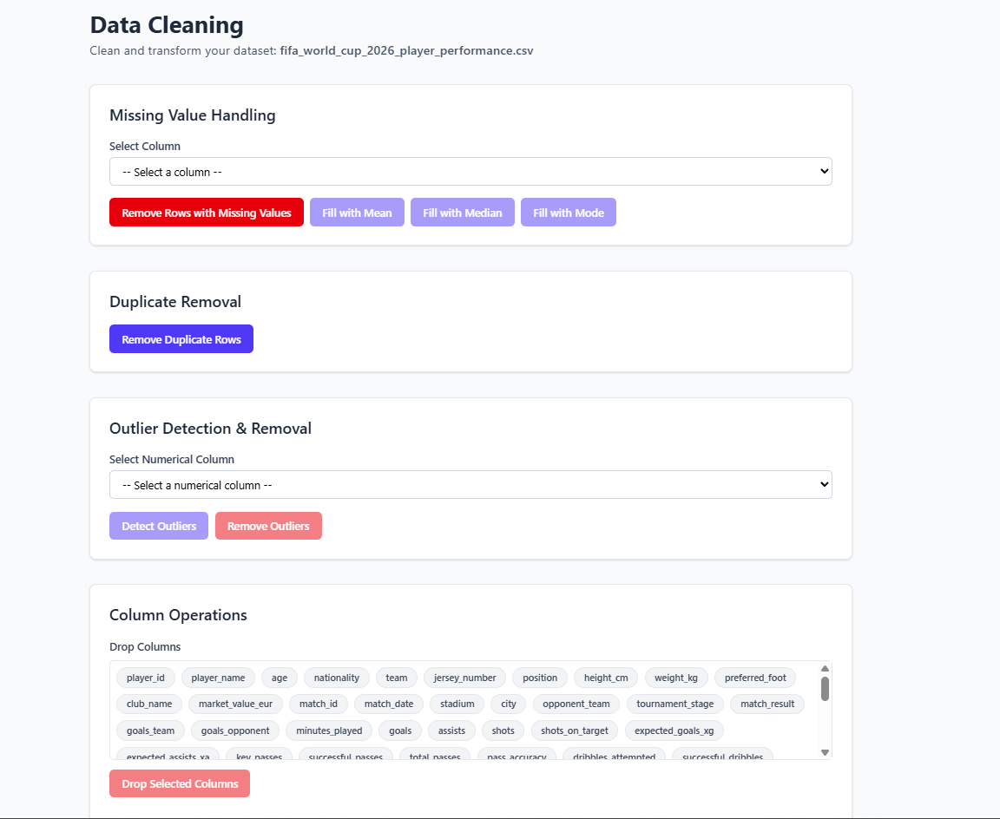

---

## 🧹 Data Cleaning (Step 2)

Additional preprocessing including encoding categorical variables and scaling numerical features.

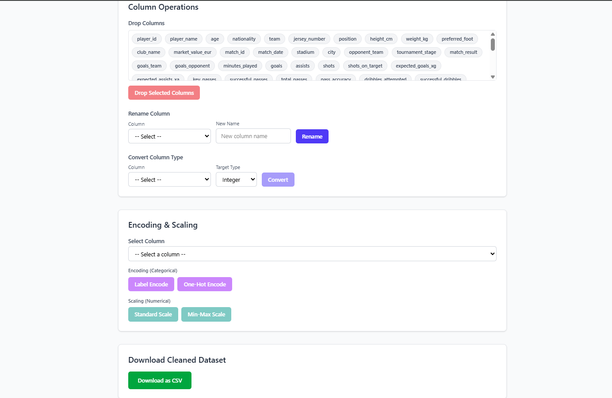

---

## 📈 Numerical Analysis

Interactive statistical analysis of numerical features.

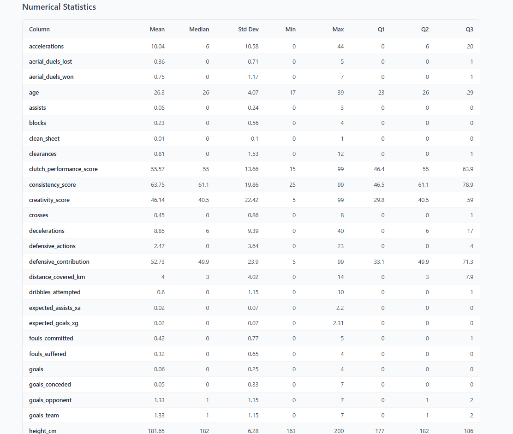

---

## 📊 Categorical Analysis

Analyze distributions of categorical features.

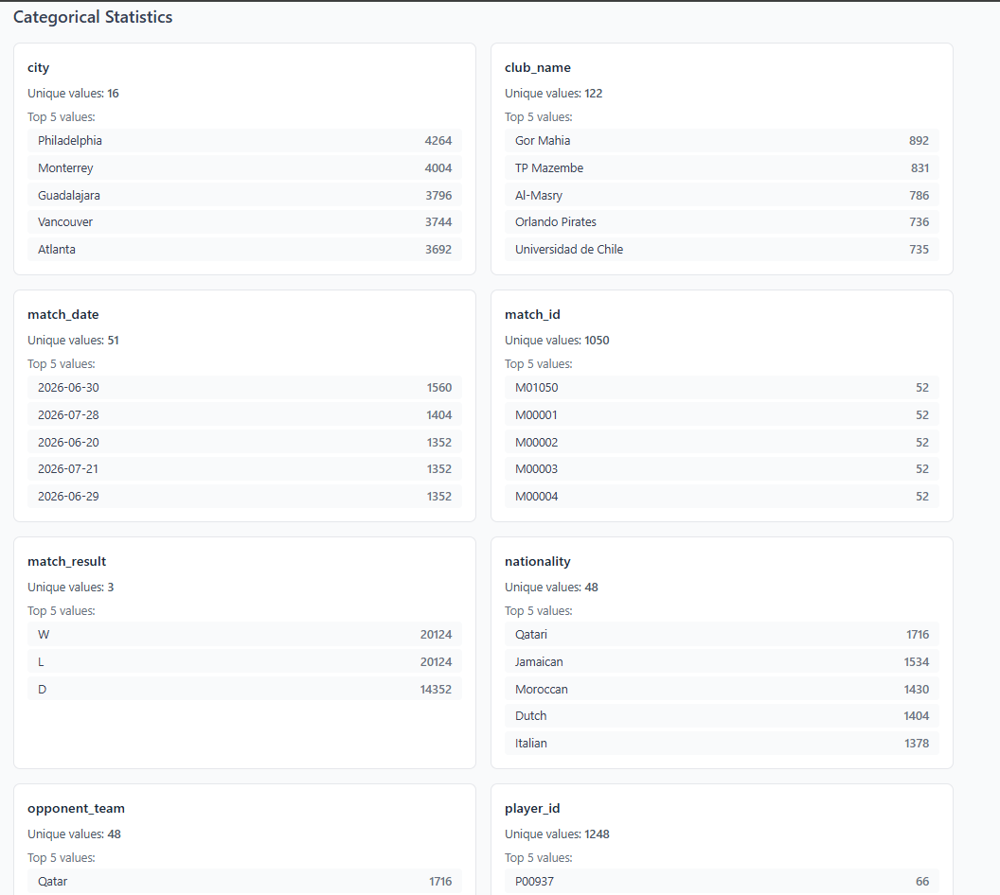

---

## 📉 Histogram Visualization

Visualize numerical distributions using histograms.

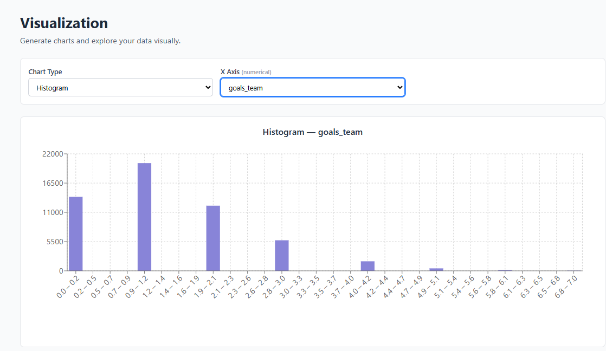

---

## 🥧 Pie Chart Visualization

Generate interactive pie charts for categorical data.

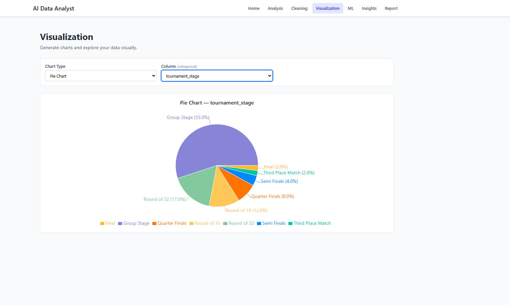

---

## 🤖 Machine Learning

Train and evaluate Machine Learning models directly from the browser.

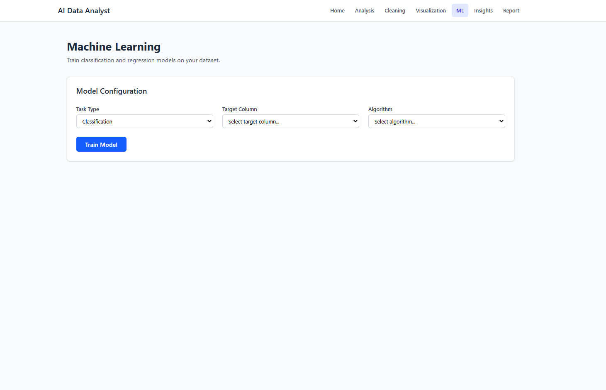

---

## 🧠 AI Insights

Generate intelligent natural-language insights using a locally running **Llama 3.2** model through Ollama.

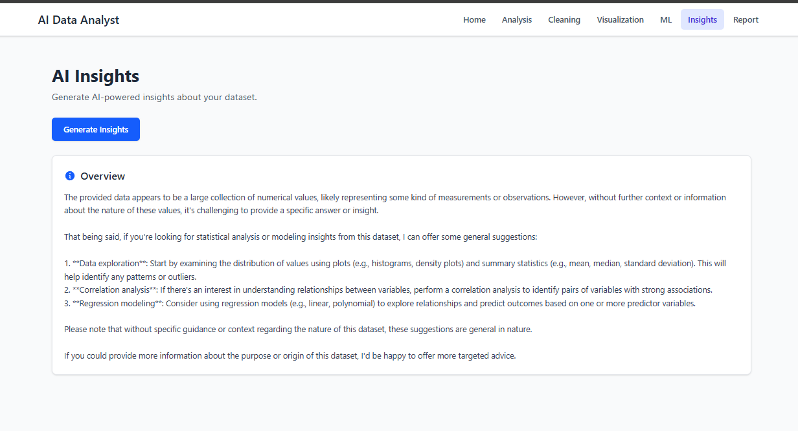

---

## 📄 Report Generation

Generate and download a comprehensive PDF report summarizing the complete analysis session.

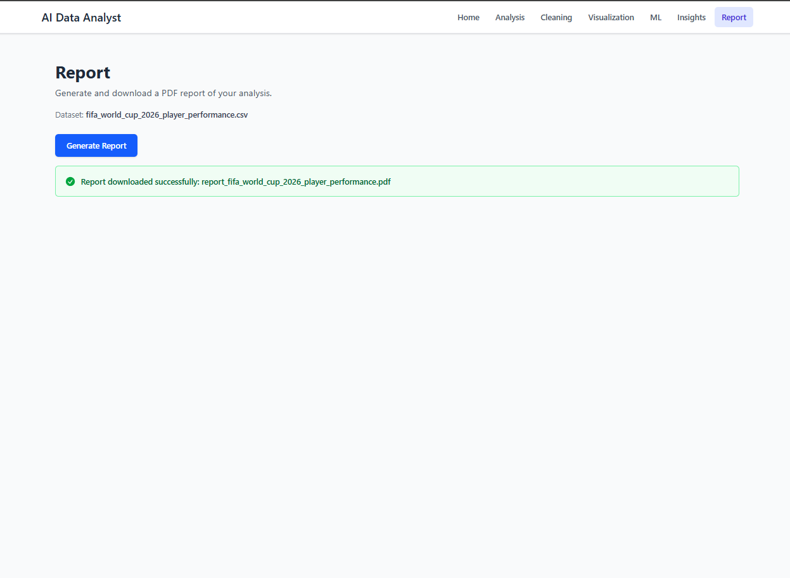

---

# 📊 Sample Dataset

This repository includes a sample dataset for demonstration purposes.

**Dataset Name**

`fifa_world_cup_2026_player_performance.csv`

**Source**

Kaggle

The dataset demonstrates the application's complete workflow including:

- Dataset Upload
- Data Profiling
- Data Cleaning
- Exploratory Data Analysis
- Interactive Visualizations
- Machine Learning
- AI Insights
- PDF Report Generation

📂 Download:

`assets/fifa_world_cup_2026_player_performance.csv`

---

# 📄 Sample Generated Report

After analysis, the application automatically generates a professional PDF report containing:

- Dataset Overview
- Missing Value Summary
- Cleaning History
- Statistical Analysis
- Machine Learning Metrics
- Feature Importance
- AI Insights
- Visualizations

📄 Sample Report

`assets/report_fifa_world_cup_2026_player_performance.pdf`

---

# 🔄 Project Workflow

```text
                Upload CSV
                     │
                     ▼
         Automatic Dataset Profiling
                     │
                     ▼
            Data Cleaning & Preprocessing
                     │
                     ▼
        Exploratory Data Analysis (EDA)
                     │
                     ▼
      Interactive Data Visualizations
                     │
                     ▼
        Machine Learning Model Training
                     │
                     ▼
       AI Insights using Llama 3.2
                     │
                     ▼
        Professional PDF Report
```
# Features

- **Dataset Upload** — Drag-and-drop or browse CSV files (up to 50 MB)
- **Analysis Dashboard** — Row/column counts, data types, missing values, descriptive statistics
- **Data Cleaning** — Handle missing values, remove duplicates, detect outliers, rename/drop/convert columns, encode categoricals, scale numericals
- **Visualization** — Histograms, scatter plots, line charts, bar charts, pie charts, box plots, correlation heatmaps
- **Machine Learning** — Train classification (Logistic Regression, Decision Tree, Random Forest) and regression models with evaluation metrics
- **AI Insights** — Generate natural language analysis using your local Llama 3.2 model via Ollama
- **PDF Reports** — Download a comprehensive PDF report of your analysis session
---

# 💡 Why AI Data Analyst?

Traditional data analysis often requires writing Python code, understanding multiple libraries, and manually generating visualizations and reports.

AI Data Analyst simplifies this entire workflow by providing a modern web interface that combines data science, machine learning, and artificial intelligence into a single application.

Whether you're a student learning data science, an analyst exploring datasets, or a developer wanting quick insights, AI Data Analyst removes the coding barrier while still providing powerful analytical capabilities.

---

# Tech Stack

| Layer | Technology |
|-------|-----------|
| Frontend | React 19, Vite 6, Tailwind CSS 4, Recharts 3, React Router 7, Axios |
| Backend | Flask 3.1, Pandas, NumPy, scikit-learn, fpdf2 |
| AI | Ollama + Llama 3.2 (local inference) |
| Testing | pytest, Hypothesis (property-based), Vitest, fast-check |

# Setup

## 1. Clone the repository

```bash
git clone https://github.com/YOUR_USERNAME/ai-data-analyst.git
cd ai-data-analyst
```

## 2. Backend setup

```bash
cd backend
python -m venv venv
venv\Scripts\activate        # Windows
# source venv/bin/activate   # macOS/Linux
pip install -r requirements.txt
```

## 3. Frontend setup

```bash
cd frontend
npm install
```

## 4. Ollama setup (for AI Insights)

```bash
# Install Ollama from https://ollama.ai
ollama pull llama3.2
ollama serve
```

# Running the Application

## Start the backend (Terminal 1)

```bash
cd backend
python app.py
```

The Flask server starts at `http://localhost:5000`.

## Start the frontend (Terminal 2)

```bash
cd frontend
npm run dev
```

The React app starts at `http://localhost:5173`.

## Open in browser

Navigate to `http://localhost:5173`

## Running Tests

### Backend tests

```bash
cd backend
python -m pytest tests/ -v
```

### Frontend tests

```bash
cd frontend
npx vitest run
```


# 🎯 Key Capabilities

### 📂 Smart Dataset Upload

- Drag-and-drop CSV upload
- Automatic validation
- Supports datasets up to **50 MB**
- Instant dataset profiling

---

### 🧹 Data Cleaning

Perform common preprocessing tasks without writing Pandas code.

Supported operations include:

- Missing value handling
- Duplicate removal
- Outlier detection (IQR)
- Rename columns
- Drop columns
- Data type conversion
- Encoding categorical variables
- Feature scaling

---

### 📊 Exploratory Data Analysis

Automatically generate:

- Dataset overview
- Missing value summary
- Data types
- Descriptive statistics
- Correlation analysis
- Distribution analysis

---

### 📈 Interactive Visualizations

Generate publication-ready charts including:

- Histograms
- Scatter plots
- Line charts
- Bar charts
- Pie charts
- Box plots
- Correlation Heatmaps

---

### 🤖 Machine Learning

Train models directly inside the application.

Supported algorithms include:

#### Classification

- Logistic Regression
- Decision Tree
- Random Forest

#### Regression

- Linear Regression
- Decision Tree Regressor
- Random Forest Regressor

Includes:

- Train/Test Split
- Performance Metrics
- Accuracy Evaluation
- Feature Importance

---

### 🧠 AI Insights

One of the application's standout features is its ability to generate natural-language insights using a locally running Large Language Model.

Powered by:

- Ollama
- Llama 3.2

Because inference runs locally:

- No internet required
- No API costs
- Better privacy
- No dataset leaves your computer

---

### 📄 Automated Report Generation

After completing the workflow, AI Data Analyst generates a comprehensive PDF report containing:

- Dataset summary
- Cleaning history
- Statistical analysis
- Visualizations
- Machine Learning results
- AI-generated insights

This report can be shared or downloaded for future reference.

---

# 🏗️ Application Architecture

```text
                 React + Tailwind Frontend
                           │
                           ▼
                     Flask REST API
                           │
     ┌───────────────┬───────────────┬───────────────┐
     │               │               │               │
     ▼               ▼               ▼               ▼
 Data Cleaning     EDA Engine    ML Engine     AI Insights
     │               │               │               │
     └───────────────┴───────────────┴───────────────┘
                           │
                           ▼
                  PDF Report Generation
```

---

# ⚡ Technologies Used

This project demonstrates practical implementation of modern technologies across the full stack.

### Frontend

- React 19
- Vite
- Tailwind CSS
- React Router
- Axios
- Recharts

### Backend

- Flask
- Pandas
- NumPy
- Scikit-learn
- FPDF2

### Artificial Intelligence

- Ollama
- Llama 3.2

### Testing

- pytest
- Hypothesis
- Vitest
- fast-check

---

# 📚 Learning Objectives

This project demonstrates knowledge of:

- Full Stack Web Development
- REST API Design
- Data Science
- Exploratory Data Analysis
- Machine Learning
- Artificial Intelligence
- Local LLM Integration
- Data Visualization
- Software Architecture
- PDF Report Generation
- Testing

---

---

# 🌟 Project Highlights

AI Data Analyst is a full-stack application that combines modern web development, data science, machine learning, and artificial intelligence into a single platform.

### Full-Stack Development
- React 19 frontend
- Flask REST API backend
- Responsive user interface
- Component-based architecture

### Data Science
- Data Cleaning
- Exploratory Data Analysis (EDA)
- Statistical Analysis
- Data Visualization

### Machine Learning
- Classification Models
- Regression Models
- Model Evaluation
- Feature Importance Analysis

### Artificial Intelligence
- Local LLM Integration
- AI-generated dataset insights
- Ollama + Llama 3.2

### Software Engineering
- REST API Development
- Modular Architecture
- PDF Report Generation
- Automated Testing

---

# 🎓 Project Purpose

This project was developed as a portfolio project to demonstrate practical implementation of:

- Full-Stack Web Development
- REST API Development
- Data Science
- Machine Learning
- Artificial Intelligence
- Data Visualization
- Software Engineering

It showcases how modern frontend technologies can be integrated with Python-based data science libraries and local AI models to build a complete end-to-end analytics platform.

---


# 👨‍💻 Author

## Maurya Trivedi

**Computer Science Engineering Student**

AI Data Analyst was built as part of my software engineering portfolio to demonstrate practical skills in:

- Full-Stack Development
- Data Science
- Machine Learning
- Artificial Intelligence
- REST API Design
- Data Visualization

### Connect With Me

- GitHub: https://github.com/mauryatrivedi100
- LinkedIn: https://linkedin.com/in/mauryatrivedi


---

# ⭐ Support

If you found this project interesting or useful, consider giving it a **⭐ Star** on GitHub.

Your support is greatly appreciated!

---

# 📄 License

This project is licensed under the **MIT License**.

See the `LICENSE` file for more information.

---

<div align="center">

### Thank you for visiting this repository! 🚀

Built with ❤️ using **React**, **Flask**, **Python**, **Machine Learning**, and **Llama 3.2**

</div>
